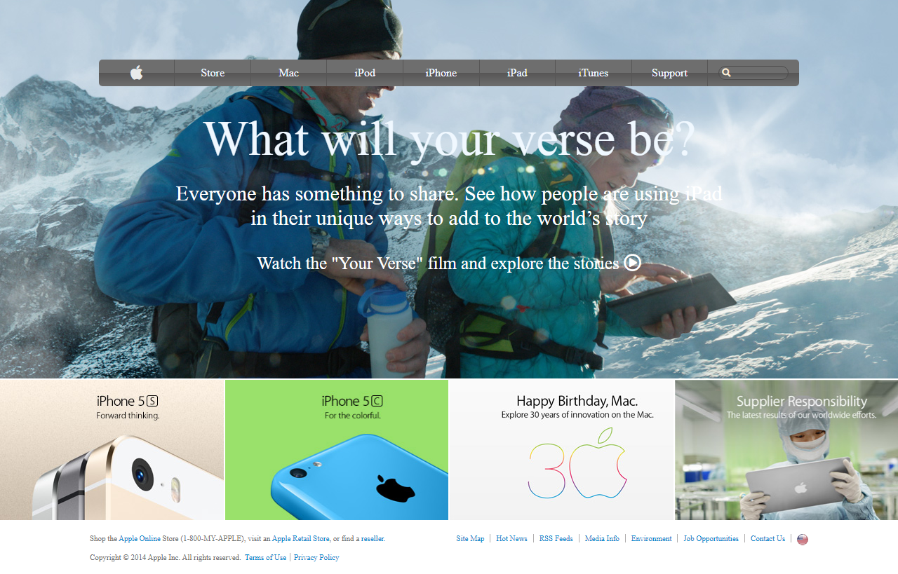

# PROJECT: BUILDING WITH BACKGROUNDS AND GRADIENTS

This is a clone of an old version of the Apple website webpage using HTML & CSS.

In this project, the website of one of the most design-forward companies in the world was cloned. It’s not a very complex site but it uses background photos and gradients. The project was built using images as a background and adding gradients to elements.
It has as main sections:
- a navigation bar whose position is relative and has a width of about 80% of the viewport
- a paragraph and anchor element which displays text on the main billboard background
- an aside element containing images in a grid display
- and lastly a footer with anchor elements

## Built With

- HTML
- CSS
- Font Awesome

## Live Demo

[Live Demo Link](https://raw.githack.com/Georjane/Apple-Website-Webpage/Apple_Landing_Page/index.html) 

## Author

👤 **Witah Ngu Geojane**

- Github: [@Georjane](https://github.com/Georjane)
- Twitter: [@WittyJany](https://twitter.com/WittyJany)
- Linkedin: [witah](https://www.linkedin.com/in/witah-georjane-74b8bb184)

## 🤝 Contributing

Contributions, issues and feature requests are welcome!

Feel free to check the [issues page](https://github.com/Georjane/Apple-Website-Webpage/issues).

## Show your support

Give a ⭐️ if you like this project!

## Acknowledgments

- Hat tip to Apple
- The Odin Project
- Microverse

## 📝 License

This project is [MIT](lic.url) licensed.
